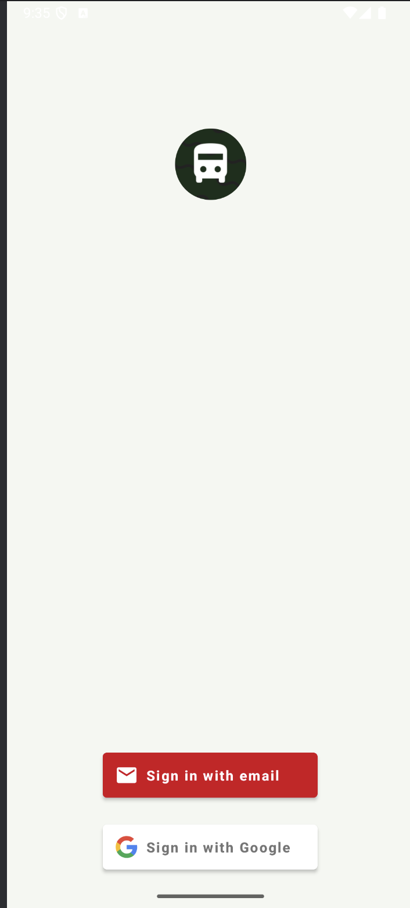
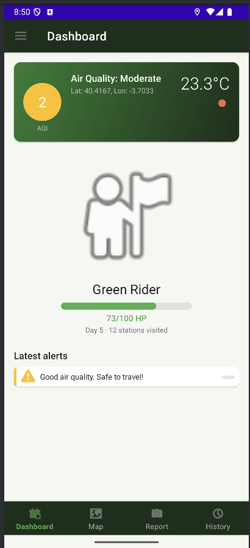
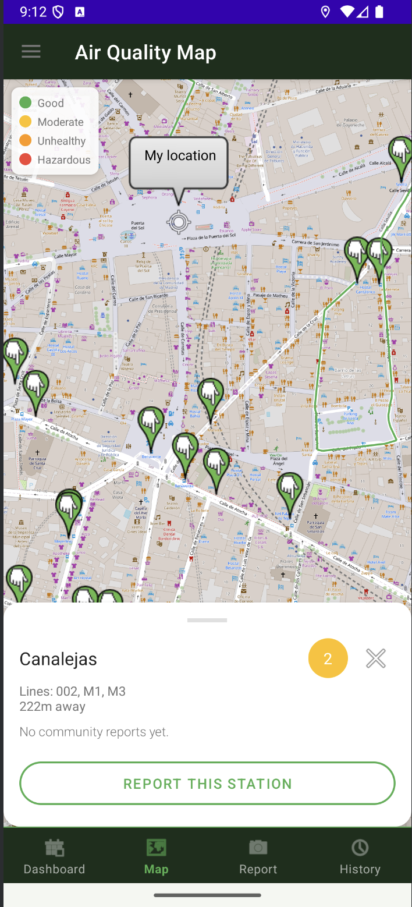
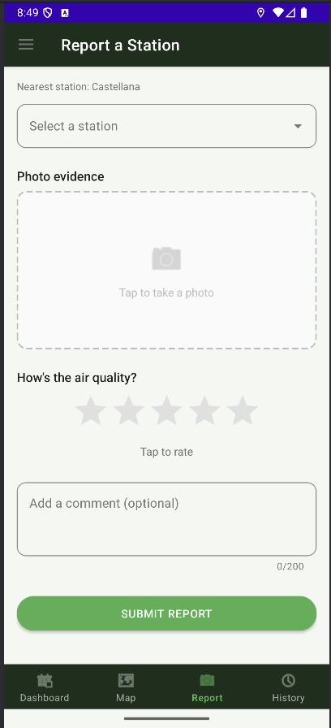
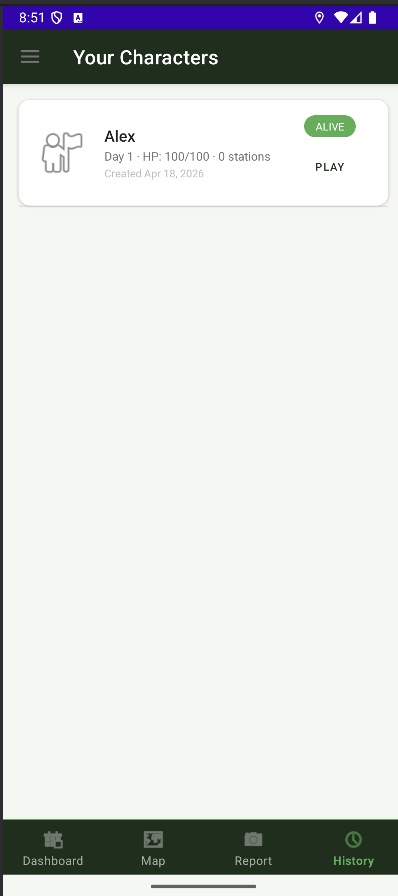
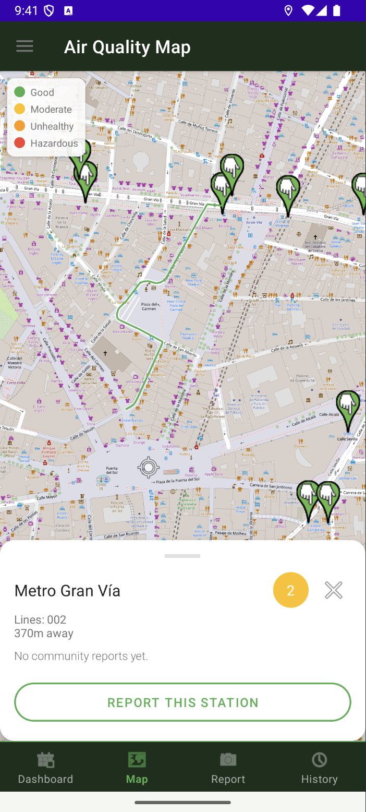

# AirBus Quest

A gamified Android app about Madrid's bus stations and air quality. Built as our Mobile App Development project (2nd year) at UPM.

## Workspace
- Repository: https://github.com/krpandrei05/project-mad
- Releases: https://github.com/krpandrei05/project-mad/releases
- Course workspace: https://upm365.sharepoint.com/sites/MobileAppDevelopment

## What is AirBus Quest?

Madrid has a pollution problem, and most air-quality apps (IQAir, BreezoMeter, etc.) just show you a number and leave it there. We wanted to try something a bit more fun: what if checking the air made you *feel* something?

So we built a game around it. You create a character with 100 HP. As you walk around Madrid and pass near EMT bus stations, the app checks the real air quality at that spot via the OpenWeather API. Clean air? Your character gains HP. Polluted air? You start losing it. Hit 0 HP and it's game over.

On top of that, users can report the state of a station (comment + star rating) in real time via Firebase, so the whole thing works a bit like a tiny community layer over Madrid's bus network.

It's obviously not meant to replace anything serious — it's a student project — but we had fun putting it together and it taught us a lot about juggling GPS, external APIs, Room, Firebase, and keeping an Android app responsive while all of that is happening in the background.

## Screenshots and navigation

<table>
  <tr>
    <td>
      
      <p align="center">Login — Firebase Auth (email + Google)</p>
    </td>
    <td>
      
      <p align="center">Dashboard — live AQI, character HP and weather</p>
    </td>
  </tr>
  <tr>
    <td>
      
      <p align="center">Map — EMT stations colored by AQI with OSRM route</p>
    </td>
    <td>
      
      <p align="center">Map — bottom sheet with distance, lines and community report</p>
    </td>
  </tr>
  <tr>
    <td>
      
      <p align="center">Report — submit community report to Firebase RTDB</p>
    </td>
    <td>
      
      <p align="center">History — character list with GPS log per character</p>
    </td>
  </tr>
</table>

## Demo video

One-minute walkthrough of the app:

<a href="https://upm365.sharepoint.com/:v:/s/Project-MAD/IQAJiQrL7LttT5j9jaoixOCZAd7sVZHQByyPitofgZRK8VU?e=iK2jza">
  
</a>

## Features

### What the user can do
- Sign in with email/password or Google via Firebase Authentication
- Create and switch between multiple characters, each with its own avatar (Commuter, Cyclist, Pedestrian)
- See real-time AQI and weather at the current location on the dashboard
- Walk near EMT bus stations and watch HP change based on the air quality around them
- Open a map with all nearby EMT stations colored by AQI level, tap one to see the lines passing through it, distance, and the latest community report
- Get a walking route from the current location to any selected station (drawn via OSRM)
- Submit community reports with rating + comment (+ optional photo) that other users can then see on the map
- Browse a per-character GPS history and manage old characters

### What's going on under the hood
- **Per-character CSV logs** for GPS positions — [DashboardFragment.kt](app/src/main/java/com/example/airbus_quest/DashboardFragment.kt)
- **SharedPreferences** for user settings, active character id, API key — [SettingsActivity.kt](app/src/main/java/com/example/airbus_quest/SettingsActivity.kt)
- **Room database** with 4 tables (CHARACTERS, STATIONS, REPORTS, AQI_LOG) and proper migrations — [AppDatabase.kt](app/src/main/java/com/example/airbus_quest/room/AppDatabase.kt)
- **Firebase Realtime Database** for community reports, written and read live — [ReportFragment.kt](app/src/main/java/com/example/airbus_quest/ReportFragment.kt)
- **Firebase Authentication** (email + Google Sign-In) via FirebaseUI — [LoginActivity.kt](app/src/main/java/com/example/airbus_quest/LoginActivity.kt)
- **OpenStreetMap** tiles via osmdroid, with colored markers and a polyline for the OSRM route — [MapFragment.kt](app/src/main/java/com/example/airbus_quest/MapFragment.kt)
- **REST APIs** (all called through Retrofit):
  - [OpenWeather](https://openweathermap.org/api) — AQI + current weather at the user's coordinates
  - [EMT Madrid MobilityLabs](https://mobilitylabs.emtmadrid.es/) — real bus stops around the user. **Important:** we applied for the official ClientId/PassKey API credentials, but EMT didn't have time to review and approve our request before the project deadline. To keep the app working, we had to fall back on the email/password login endpoint (`/v1/mobilitylabs/user/login/`) instead. **The credentials used are our own personal EMT accounts**, which is why they are not shipped with the code — anyone cloning the repo has to put their own credentials into [Credentials.kt](app/src/main/java/com/example/airbus_quest/Credentials.kt) (see the setup section below).
  - [OSRM](https://router.project-osrm.org/) — real street-level routing from the user to the selected station
- **Navigation** — Drawer + bottom navigation with 4 tabs + toolbar
- **Glide** for loading the weather icon from an external URL
- **LocationManager** (GPS provider) with 4-decimal precision, timestamp and altitude

## How to run it yourself

### 1. Clone the repo
```bash
git clone https://github.com/krpandrei05/project-mad.git
cd project-mad
```

### 2. Set up EMT credentials (important!)

Normally, an app talking to the EMT Madrid API should authenticate with a ClientId/PassKey pair assigned by EMT. We applied for those, but our request was never processed in time — so we had to work around it by logging in with a regular user account directly. The app uses **our personal EMT accounts** to authenticate, which is why you won't find valid credentials committed in the repo. You'll need to create your own.

- Sign up for a free account at https://mobilitylabs.emtmadrid.es/ (takes about 5 minutes)
- Confirm your email
- Open [app/src/main/java/com/example/airbus_quest/Credentials.kt](app/src/main/java/com/example/airbus_quest/Credentials.kt) and paste your own email and password in place of the placeholders:

```kotlin
object Credentials {
    const val EMT_EMAIL = "your_emt_email@example.com"
    const val EMT_PASSWORD = "your_emt_password"
}
```

Yes, we know putting credentials directly in code isn't great. If EMT had approved our ClientId/PassKey we'd have used that instead — this is a temporary workaround for the school project deadline, not something we'd ever do in a real app.

### 3. Set up Firebase
- Create a project at https://console.firebase.google.com
- Enable **Authentication** (Email/Password + Google)
- Enable **Realtime Database** (test mode is fine for development)
- Download `google-services.json` and drop it into the `app/` folder
- Add your debug SHA-1 to Firebase (needed for Google Sign-In). Get it with:
  ```bash
  ./gradlew signingReport
  ```

### 4. Set up OpenWeather
- Get a free key at https://openweathermap.org/api
- Open the app → **Settings** → paste the key in the API key field

### 5. Build and run
- Open the project in Android Studio
- Sync Gradle
- Run on a physical device or emulator **with GPS set to a location in Madrid** (otherwise EMT returns zero stations — we learned this the hard way). Puerta del Sol at `40.4168, -3.7038` is a good test point.

## What we used (stack summary)

| Layer | Tech |
|-------|------|
| Language | Kotlin |
| UI | Android XML + Material Components |
| Architecture | MVVM (ViewModel + LiveData) |
| Local DB | Room (SQLite) |
| Network | Retrofit 2 + Gson |
| Maps | osmdroid (OpenStreetMap) |
| Backend | Firebase (Auth + Realtime Database) |
| Images | Glide |
| Async | Kotlin Coroutines |
| Min SDK / Target SDK | 24 / 36 |

## Team

Two second-year students at UPM:

- **Chiriac Alex** (GitHub: [@ChiriacAlex](https://github.com/ChiriacAlex)) — alex.chiriac@alumnos.upm.es
- **Andrei-Costin Carp** (GitHub: [@krpandrei05](https://github.com/krpandrei05)) — andrei-costin.carp@alumnos.upm.es

Workload split roughly 50/50 — we paired on the architecture and split the feature work, merging through GitHub.

## Honest notes

Things we'd do differently with more time:
- Use the official EMT ClientId/PassKey once approved (the email+password workaround is fine for a demo but not production-clean)
- Upload report photos to Firebase Storage instead of only holding a local URI
- Add some unit tests (we have zero, which is… not great)
- Migrate to Jetpack Compose — we went with XML because that's what we were taught first, but Compose would have been cleaner

Thanks for taking a look.
